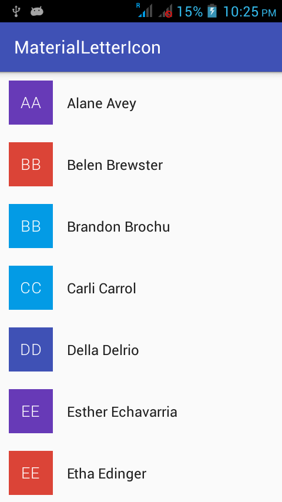
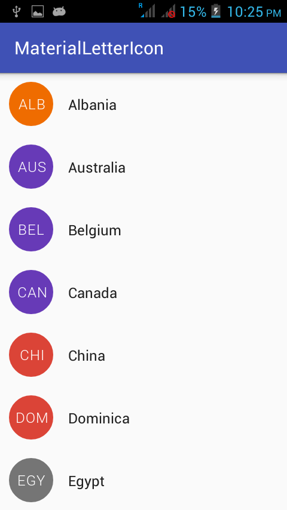
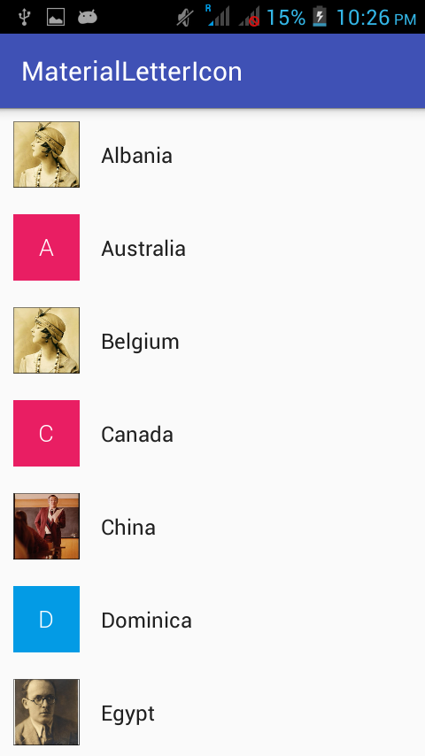
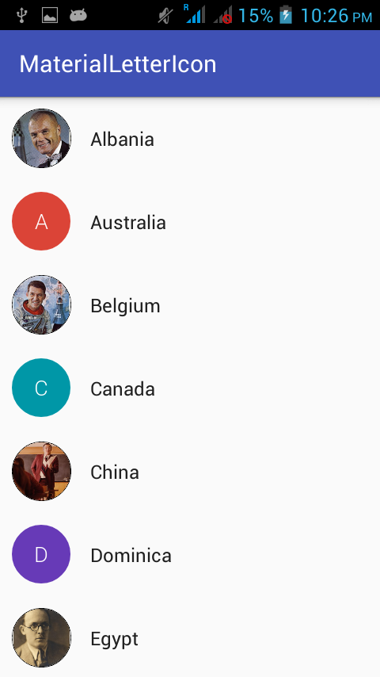

# ImageLetterIcon
Material letter icon with circle background. Also supports for image for user contact.

[](https://android-arsenal.com/details/1/2762)

 [  ](https://bintray.com/akashandroid90/maven/image-letter-icon/_latestVersion)
 
 <a href='https://bintray.com/akashandroid90/maven/image-letter-icon/view?source=watch' alt='Get automatic notifications about new "image-letter-icon" versions'></a>

<a href="https://play.google.com/store/apps/details?id=com.imagelettericon" alt="Download from Google Play">
  
</a>






Gradle
-------------------------

```

dependencies {
    compile 'com.github.akashandroid90:imageletter:1.8@aar'
}

```

ChangeLog
-----

bug fixes

vector drawable support 

Usage
-----

Declare in XML (see xml attributes below for customization):

```xml
<com.github.akashandroid90.imageletter.MaterialLetterIcon
    android:layout_width="@dimen/letter_icon_size"
    android:layout_height="@dimen/letter_icon_size" />
```

Or static initializer (see xml attributes below for customization):

```java
MaterialLetterIcon icon = new MaterialLetterIcon.Builder(context) //
            .shapeColor(getResources().getColor(R.color.circle_color))
            .setShapeType(MaterialLetterIcon.SHAPE_CIRCLE)
            .letter("S")
            .letterColor(getResources().getColor(R.color.letter_color))
            .letterSize(26)
            .lettersNumber(1)
            .letterTypeface(yourTypeface)
            .initials(false)
            .initialsNumber(2)
            .create();
```


Configure using xml attributes or setters in code:

```java
app:shape_color="@color/black"      // shape color
app:shape_type="circle"             // shape type
app:letter=""                       // letter or string to get first letter from
app:letter_color="@color/white"     // letter color
app:letter_size="26"                // letter size SP
app:letters_number="1"              // number of letters to get from string
app:initials="false"                // turn on initials mode
app:initials_number="2"             // number of initials to be showed
app:corner_radius="1dp"             // radius of image to make at corner
app:is_oval="true"                  // to make a circular image
app:border_width="1dp"              // border width around the image
app:border_color="@color/black"     //border color around image
```


Developed By
--------------------
Akash Jain
